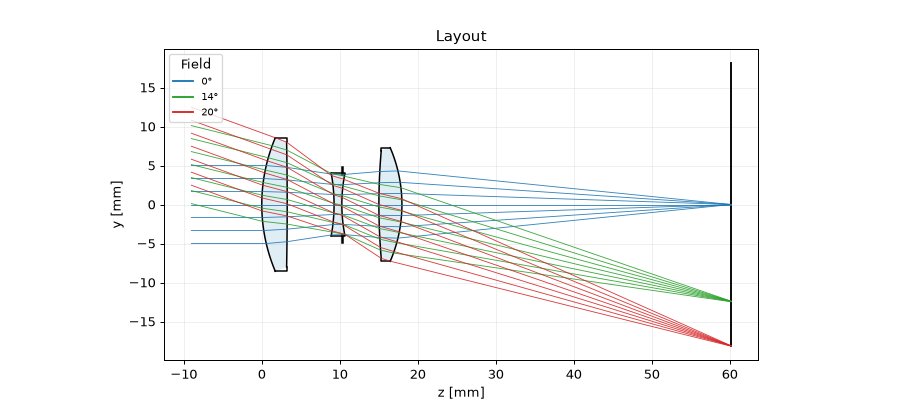
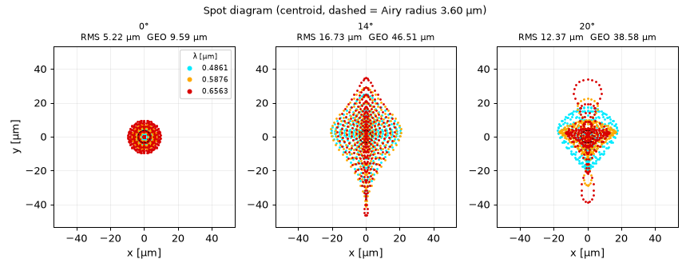
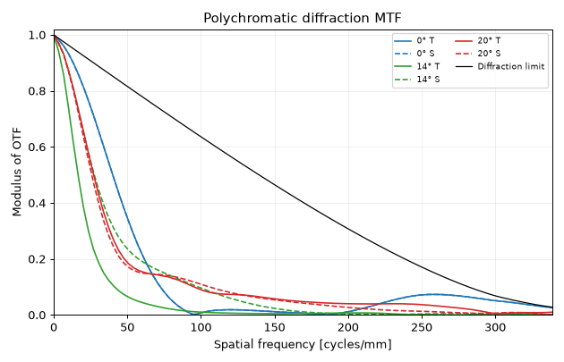
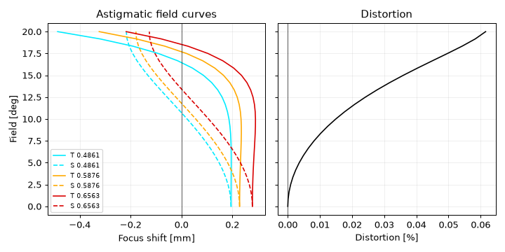

# opteval — CODE V 風 光学設計評価ツール

回転対称な逐次光学系（球面・コーニック・偶数次非球面）を対象に、
近軸計算・実光線追跡・収差解析・回折評価・簡易最適化を行う Python ツールです。
依存は NumPy と Matplotlib のみです。



## 機能

| 分類 | 内容 |
|---|---|
| レンズデータ | JSON 形式（OBJ / 各面 / IMG）。曲率半径・面間隔・硝材・有効径・コーニック・非球面係数・絞り |
| 硝材 | Sellmeier 式カタログ（N-BK7, N-SK16, F2, N-F2, N-SF5, N-SF11, N-BAF10, SILICA, CAF2）、モデルガラス `"nd:vd"`、固定屈折率 |
| 物体・開口・視野 | 無限遠 / 有限物体、EPD・FNO・NAO 指定、画角または物体高、多波長（重み付き） |
| 近軸（一次量） | EFL, BFL, 前側焦点, F/#, 作動 F/#, NA, 入射瞳・射出瞳, 倍率, 像高, Lagrange 不変量, 軸上・倍率色収差 |
| Seidel 収差 | 面ごとの SI〜SV, CI, CII（非球面の寄与を含む）と波面収差係数 W040, W131, W222, W220, W311 |
| 実光線追跡 | ベクトル化した Snell 追跡、非球面は Newton 法による交点計算、全反射・有効径によるケラレ判定 |
| 像性能評価 | スポットダイアグラム（RMS / GEO）、横収差図、OPD 図、波面マップ（RMS / P-V）、非点収差図・歪曲、FFT PSF（Strehl）、多色回折 MTF |
| 最適化 | 減衰最小二乗法（Levenberg–Marquardt）、変数（曲率・面間隔・コーニック・非球面係数）、EFL 目標値、近軸像面ソルブ |
| 出力 | テキストレポート、PNG 評価図、HTML レポート（図の埋め込み付き） |

## 使い方

```bash
cd optical-eval
pip install -r requirements.txt      # または pip install -e .

# レンズデータ・一次量・Seidel 係数・結像性能をテキストで表示
python -m opteval info examples/cooke_triplet.json

# 評価図 (PNG) + report.txt + report.html を出力
python -m opteval report examples/cooke_triplet.json -o report/

# レンズファイル内の "optimization" 設定で最適化
python -m opteval optimize examples/doublet_start.json -o doublet_opt.json
```

Python から直接使うこともできます。

```python
from opteval import OpticalSystem, Evaluator, first_order, seidel
from opteval import analysis as an

sysm = OpticalSystem.load("examples/cooke_triplet.json")
ev = Evaluator(sysm)
print(first_order(sysm).efl)                    # 50.021...
print(an.spot(ev, 14.0).rms * 1e3, "µm")        # RMS スポット半径
m = an.mtf(ev, 20.0, max_freq=100)              # MTF (freq, tangential, sagittal)
print(seidel(sysm).wave_coefficients())
```

## レンズファイル形式

```json
{
  "title": "Cooke Triplet",
  "wavelengths": ["F", "d", "C"],          // µm の数値または Fraunhofer 線の記号
  "wavelength_weights": [1, 1, 1],
  "primary": 1,                             // 主波長のインデックス
  "fields": {"type": "angle", "values": [0, 14, 20]},   // "angle" [deg] or "height" [mm]
  "aperture": {"type": "EPD", "value": 10},             // EPD / FNO / NAO
  "surfaces": [
    {"radius": "inf", "thickness": "inf", "comment": "OBJ"},
    {"radius": 22.01359, "thickness": 3.25896, "material": "N-SK16"},
    {"radius": 20.29192, "thickness": 4.75041, "material": "AIR", "stop": true},
    {"radius": 50.0, "thickness": 5.0, "material": "1.62:36.4",
     "conic": -0.5, "aspheric": [1e-6, -2e-9], "semi_diameter": 6.0},
    {"radius": "inf", "thickness": 0, "comment": "IMG"}
  ]
}
```

* `thickness` と `material` は「その面から次の面まで」の値です（CODE V と同じ）。
* `semi_diameter` を省略すると自動計算され、光線はケラレません。指定すると固定径になり、その径を超える光線はケラレます。
* 面形状: `z = c r² / (1 + √(1 − (1+k) c² r²)) + A4 r⁴ + A6 r⁶ + …`

最適化設定の例は [`examples/doublet_start.json`](examples/doublet_start.json) を参照してください。

## 出力例（Cooke トリプレット f=50 mm, F/5, ±20°）

| スポットダイアグラム | MTF |
|---|---|
|  |  |



## 計算上の規約

* 光は +z 方向に進み、物体点は +y 側にあります（像は −y 側にできます）。
* 光線は近軸入射瞳に向けて射出します（実光線エイミングは未実装）。
* OPD は主波長の主光線像点を中心とし、射出瞳を通る参照球を基準にしています。
  正の OPD は波面が参照球より進んでいることを表し、Seidel の W 係数と符号が一致します。
* MTF と PSF は瞳関数の FFT で求めています。カットオフ周波数は近軸の作動 F/# から決めています。
* スポットの RMS は、重み付き多色重心を基準にしています。

## 検証

`pytest` で以下を確認しています（`python -m pytest tests`）。

* 硝材の nd / νd がカタログ値と一致すること
* 厚肉レンズの EFL が解析式と一致すること
* Cartesian oval（楕円面, k = −1/n²）が無収差になること（W = 0, Strehl = 1, MTF = 回折限界）
* 小口径・小画角で、Seidel 係数（W040, W131, W222 + W220, W040 + W220）と実光線 OPD が 1–2 % 以内で一致すること
* PSF の向きが光線追跡と一致すること、ケラレ、有限物体の倍率、JSON の往復変換、最適化の収束

## 今後の拡張候補

ミラー（反射面）、偏心・傾き、実光線エイミング、公差解析、グローバル最適化、
Zemax / CODE V 形式のインポート、GUI（Qt / Web）など。
